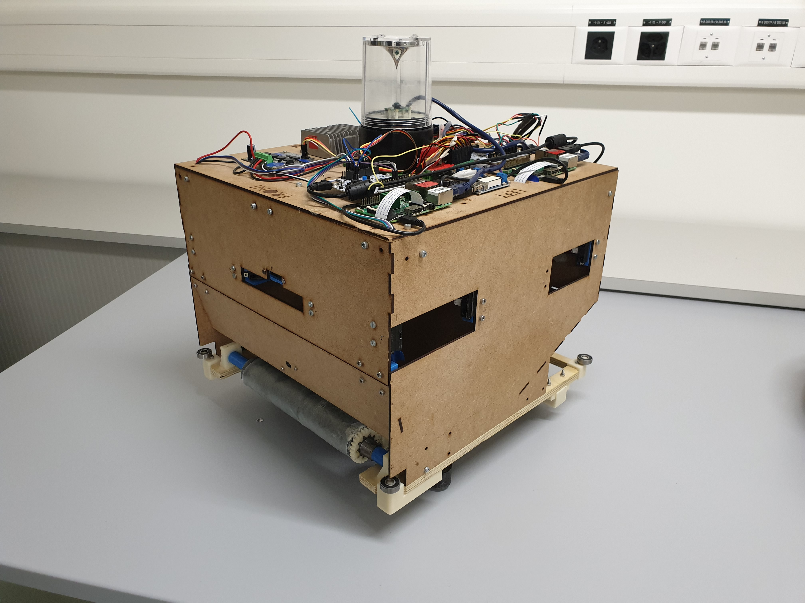
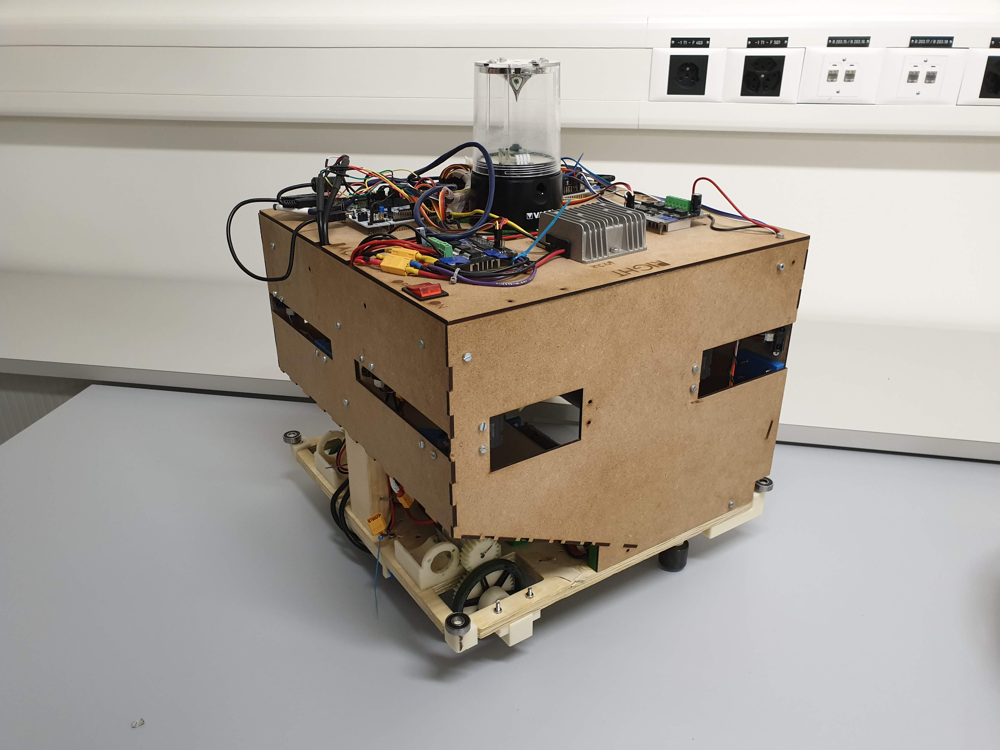
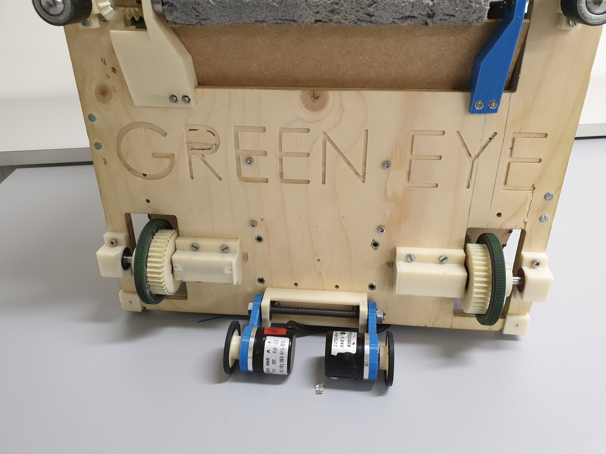

EPFL Robotics Competition: mechanical design repository. 

Complete description of the job done here: https://apiquet.com/2019/08/20/epfl-robotics-competition/

# Description

The goal of the EPFL (Ecole Polytechnique Fédérale de Lausanne) Robotics Competition is to build an autonomous recycling robot.  This robot, built from scratch, must recognizes any bottle (thanks to a camera), catch it, then bring it to a recycling area.

Azzano Guilhem, Erbacher Pierre and I formed the Green Eye team, Winner of the 2019 Edition.

My responsibilities were:

- modeling the collector mecanism to catch the bottles and the system to store them: https://apiquet.com/2019/08/20/epfl-robotics-competition/

- visual recognition using Python and/or C++ to recognize the bottles and guide the robot to them: https://apiquet.com/2019/06/02/visual-recognition/

- Triangularization of the Robot’s position and orientation from an homemade Beacon: https://apiquet.com/2019/06/13/beacon/

# Our robot

